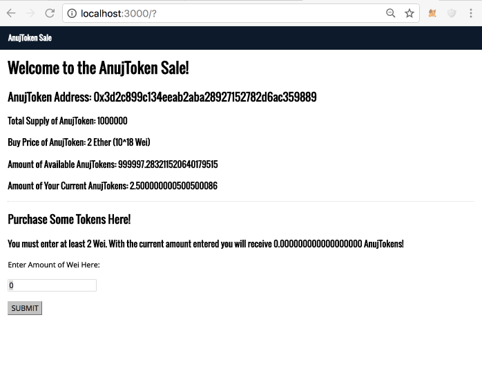

## ConsenSys Token Small Project

- Total Supply Tokens will be 1,000,000 Tokens
- The buy price will be automatically assigned as 2 Ether per Token on deployment. 
- If the total supply has been fully distributed then the page will render "THE TOKEN SALE IS OVER!"


*Every time you switch between MetaMask accounts you will have to reload the page for the app to get linked to your account.*    

  
View this gif as an example (might take a few seconds to load):  




----

*When doing the function call on the frontend - successful transactions will be alerted with a successful message and all errors will be alerted with an error message.*  

----
## Installation

1. Install truffle and EthereumJS TestRPC.
    ```javascript
    npm install -g truffle // Version 3.0.5+ required.
    npm install -g ethereumjs-testrpc
    ```


2. Install all node modules within the directory.
    ```javascript
    npm install 
    ```


3. Have geth running or run testrpc.
    ```javascript
    testrpc 
    ```


4. Compile and migrate the contracts.
    ```javascript
    truffle compile
    truffle migrate
    ```


5. Run the webpack server for front-end hot reloading. For now, smart contract changes must be manually recompiled and migrated.  

*This will launch on port 3000 - if using a guest please forward port 3000 on guest to a port of choice on your host*  

 ```javascript
  npm run start
 ```
----

- `accounts[0]` in TestRPC will automatically be assigned as an owner of the AnujToken contract. 


- The initial supply of all tokens is assigned to the owner of the contract. 
    

- Adding accounts to MetaMask private network and TestRPC will allow you to purchase AnujToken. 


____


